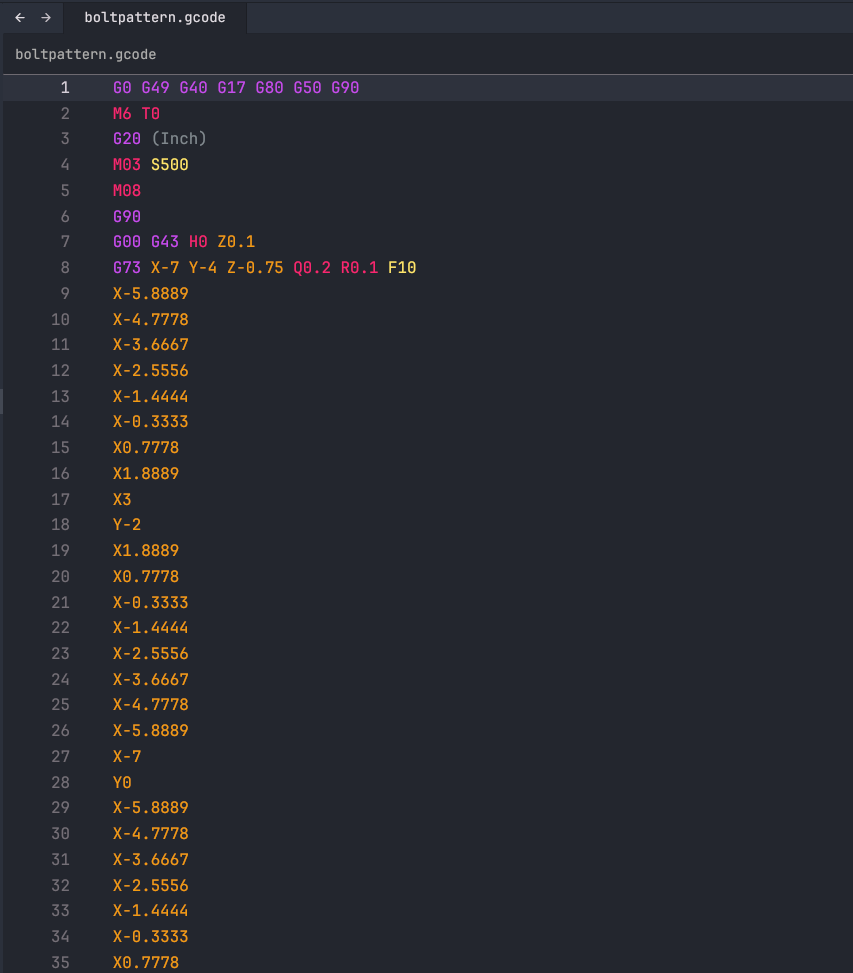

# zed-gcode

[G-code](https://en.wikipedia.org/wiki/G-code) support for [Zed](https://zed.dev).

- Tree-sitter: [tree-sitter-gcode](https://github.com/ChocolateNao/tree-sitter-gcode)



## Extensions

This extension currently supports the following file extensions:

|          |          |          |          |          |          |
|----------|----------|----------|----------|----------|----------|
| ply      | sub      | g        | tap      | nc       | ncd      |
| gco      | bfb      | gcode    | eia      | tcn      | fgc      |
| gp       | knc      | ssb      | dnc      | ncf      | xpi      |
| lib      | min      | nci      | fnc      | spf      | cnc      |
| din      | g00      | mmg      | ecs      | gcd      | m        |
| mpt      | ncg      | ncp      | sbp      | anc      | aptcl    |
| mpf      | hnc      | ngc      | prg      | pim      | apt      |
| 001      | cls      | fan      | plt      | pu1      | pit      |
| rol      | S        | gc       | out      |          |          |

## Usage

### Zed Extensions

1. Open Zed
2. Press <kbd>Ctrl</kbd>+<kbd>Shift</kbd>+<kbd>X</kbd> to open Zed extensions menu (alternatively, you can open the menu by typing _zed: extensions_ in the command palette (<kbd>Ctrl</kbd>+<kbd>Shift</kbd>+<kbd>P</kbd>))
3. Search for the __G-code__ extension and install it

## Configuration

Although this extension supports a huge variety of file extensions, you can extend it by adding [`file_types`](https://zed.dev/docs/configuring-zed#file-types) to your Zed project or user settings:

```json
{
  "file_types": {
    "G-code": ["nc"]
  }
}
```

## License

[MIT](https://github.com/ChocolateNao/zed-gcode/blob/master/LICENSE)
